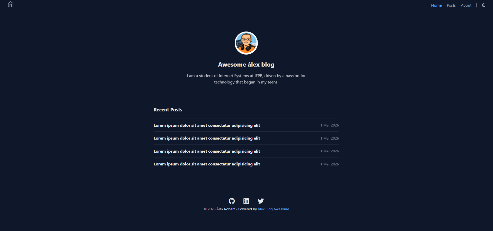

<div align="center">
  <h1>Awesome Alex Blog</h1>
  <p>Blog pessoal desenvolvido como projeto de estudo e portfólio para praticar desenvolvimento front-end, organização de código e publicação com GitHub Pages.</p>
  
  
  <br>
  
  
  
  
  
  
  <br><br>
  
  
  
  
  

  <br><br>
  🔗 Acesse o projeto:  
    https://robertifpb.github.io/awesome-alex-blog/

</div>

---

## 📖 Sobre o projeto

O **Awesome Alex Blog** é um blog estático criado para compartilhar aprendizados, registrar atividades de desenvolvimento e praticar conceitos de HTML, CSS e JavaScript.

O projeto também serve como laboratório para experimentar:

- Estruturação semântica de páginas web
- Responsividade
- Dark mode / Light mode
- Componentização de layout
- Organização de projeto front-end

---

## ✨ Funcionalidades

- 📄 Página inicial com listagem de posts
- 👨‍💻 Página **About** com informações do autor
- 🌙 Suporte a **Dark Mode e Light Mode**
- 📱 Layout **responsivo**
- 🔗 Links para redes sociais
- 📅 Data das postagens
- 🧭 Navegação simples e acessível

---

## 🛠️ Tecnologias utilizadas

- HTML5
- CSS3
- JavaScript
- Git & GitHub
- GitHub Pages
- Font Awesome

---

## 📂 Estrutura do projeto

```
awesome-alex-blog/
│
├── index.html
├── about.html
│
├── css/
│ └── style.css
│
├── js/
│ └── script.js
│
└── assets/
└── images/
  └── preview.png
```

---

## 🚀 Como executar o projeto

1. Clone o repositório

```bash 
git clone https://github.com/robertifpb/awesome-alex-blog.git 
```

2. Acesse a pasta do projeto

```bash 
cd awesome-alex-blog
```


3. Abra o arquivo `index.html` no navegador.

---

## 🎯 Objetivo do projeto

Este projeto faz parte da minha jornada de aprendizado em **desenvolvimento web**, com foco em evoluir para **Full Stack Developer**.

Ele também é utilizado para registrar atividades e progresso durante meus estudos.

---

## 👨‍💻 Autor

**Álex Robert Braz**

- 💼 LinkedIn: https://www.linkedin.com/in/arobertdev/
- 💻 GitHub: https://github.com/robertifpb
- 🌐 Blog: https://robertifpb.github.io/awesome-alex-blog/
- 📧 Email: alexrobert.dev@hotmail.com

Estudante de **Sistemas para Internet (IFPB)** apaixonado por tecnologia e desenvolvimento web.

---

⭐ Se você gostou do projeto, considere deixar uma **star no repositório**!